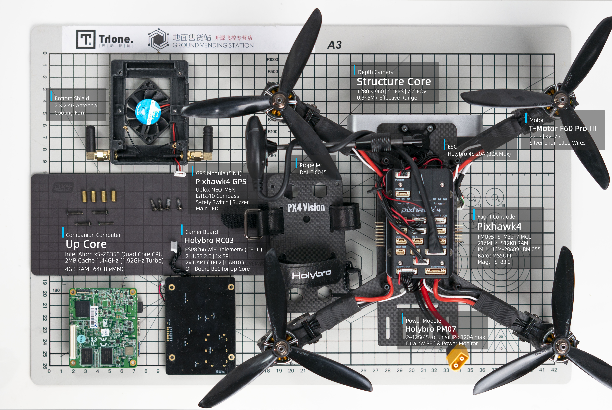
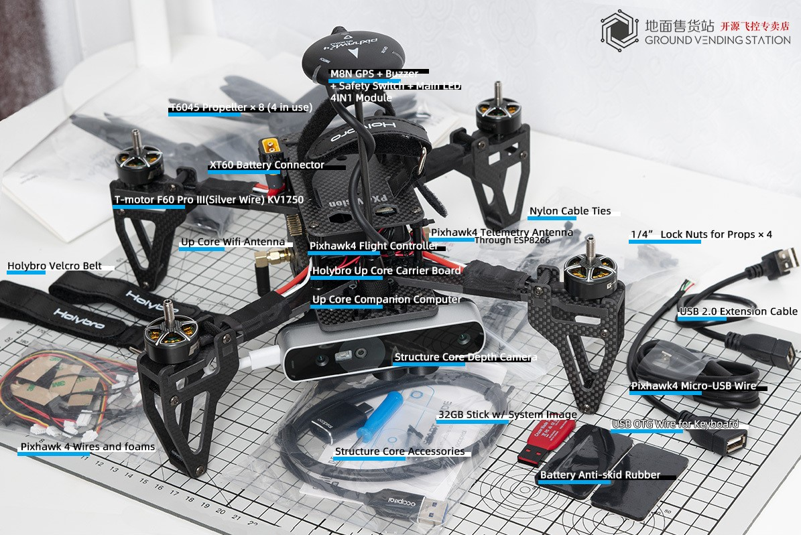
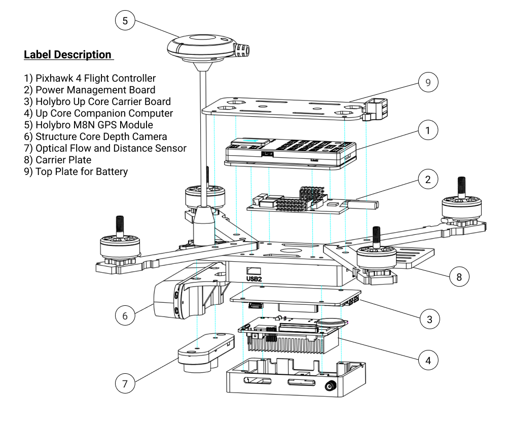

# PX4 Vision Autonomy Development Kit

The [*PX4 Vision Autonomy Development Kit*](http://www.holybro.com/product/px4-vision/) is a robust and inexpensive kit for enabling computer vision development on autonomous vehicles.


The kit contains a near-ready-to-fly carbon-fiber quadcopter equipped with a *Pixhawk 4* flight controller, a *UP Core* companion computer (4GB memory & 64GB eMMC), and a Occipital *Structure Core* depth camera sensor.

The vehicle comes with software for PX4 [Obstacle Avoidance](../computer_vision/obstacle_avoidance.md) and [Collision Prevention](../computer_vision/collision_prevention.md) enabled “out of the box”. Developers can use the kit to try out other features provided by the [PX4 Avoidance](https://github.com/PX4/avoidance#obstacle-detection-and-avoidance) project, modify the existing code, or experiment with completely new computer vision-based functionality.

The guide explains the minimal additional setup required to get the vehicle ready to fly (installing an RC system and battery). It also covers the first flight, and how to get started with modifying the computer vision code.

## Purchase

- [Holybro Website](https://shop.holybro.com/px4-vision_p1225.html?)

## Px4 Vision Guide Content
- [Warnings & Notifications](#Warnings-and-Notifications)
- [What's Inside](#What's-inside)
- [What Else Do You Need](#What-Else-Do-You-Need)
- [First-time Setup](#First-time-Setup)
- [Fly the Drone with avoidance](#Fly-the-Drone-with-Avoidance)
- [Development using the Kit](#Development-using-the-Kit)
- [Px4 Vision Carrier Board Pinouts](#Px4-Vision-Carrier-Board-Pinouts)
- [Other Development Resources](#Other-Development-Resources)
- [How to get Technical Support](#How-to-get-Technical-Support)

## Warnings and Notifications

1. The kit is intended for computer vision projects that use a forward-facing camera (it does not have downward or rear-facing depth cameras). Consequently it can’t be used (without modification) for testing [Safe Landing](../computer_vision/safe_landing.md), or other features that require a downward-facing camera.

2. Obstacle avoidance in missions can only be tested when GPS is available (missions use GPS co-ordinates). Collision prevention can be tested in position mode provided there is a good position lock from either GPS or optical flow.

3. The port labeled `USB1` may jam the GPS if used with a *USB3* peripheral (disable GPS-dependent functionality including missions). This is why the boot image is supplied on a *USB2.0* memory stick.

4. The *UP Core* should only be powered using the battery (do not remove the *UP Core* power socket safety cover).

   

## What's Inside






The DevKit contains following components:
- PX4 Vision drone kit with these internal parts:
  - 1x Pixhawk 4 flight controller (with custom PX4 firmware)
  - 1x pmw3901 optical flow sensor
  - 1x distance sensor
  - 1x Structure Core depth camera
  - 1x *UP Core* computer (4GB memory & 64GB eMMC with Ubuntu and PX4 avoidance)
    - Atom CPU
    - FTDI UART connected to flight controller
    - `USB1`: USB3.0 A port used for booting PX4 avoidance environment from a USB2.0 stick (connecting a USB3.0 peripheral may jam GPS).
    - `USB2`: USB2.0 port on a JST-GH connector.
      Can be used for second camera, LTE, etc. (or keyboard/mouse during development).
    - `USB3`: USB2.0 JST-GH port connected to depth camera
    - `HDMI`: HDMI out
    - SD card slot
    - WiFi (attached to external antenna #1).
      Allows computer to access home WiFi network for Internet access/updates.
  - ESP8266 connected to flight controller (attached to external antenna #2).
    Enables wireless connection to the ground station.
- A USB2.0 stick with pre-flashed software that bundles:
  - Ubuntu 18.04 LTS
  - ROS Melodic
  - Occipital Structure Core ROS driver
  - MAVROS
  - [PX4 Avoidance](https://github.com/PX4/avoidance#obstacle-detection-and-avoidance)
- Assorted cables, propellers, and other accessories (these can be used to attach additional peripherals).


## What Else Do You Need

The kit contains all the essential drone hardware except a battery and a radio control system, which must be purchased separately:
- Battery:
  - 4S LiPo with XT60 female connector
  - Less than 115mm long (to fit between power connector and GPS mast)
- Radio control system
  - Any [PX4-compatible RC System](../getting_started/rc_transmitter_receiver.md) can be used.
  - An *FrSky Taranis* transmitter with R-XSR receiver is one of the more popular setups.
- An H2.0 Hex Key (to unscrew the top plate so that an RC receiver can be connected)

In addition, users will need ground station hardware/software:
- Laptop or tablet running [QGroundControl](https://docs.qgroundcontrol.com/en/getting_started/download_and_install.html) (QGC).


## First-time Setup

1. Attach a [compatible RC reciever](../getting_started/rc_transmitter_receiver.md#connecting-receivers) to the vehicle (not supplied with kit):
   - Remove/unscrew the top plate (where the battery goes) using an H2.0 hex key tool.
   - [Connect the receiver to the flight controller](../assembly/quick_start_pixhawk4.md#radio-control).
   - Re-attach the top plate.
   - Mount the RC receiver on the *UP Core* carrier board plate at the back of the vehicle (use zipties or double-sided tape).
   - Ensure the antennas are clear of any obstructions and electrically isolated from the frame (e.g. secure them under the carrier board or to the vehicle arms or legs).

1. [Bind](../getting_started/rc_transmitter_receiver.md#binding) the RC ground and air units (if not already done).
   The binding procedure depends on the specific radio system used (read the receiver manual).
1. Raise the GPS mast to the vertical position and screw the cover onto the holder on the base plate.

   

1. Insert the pre-imaged USB2.0 stick from the kit into the *UP Core* port labeled `USB1` (highlighted below).

   
1. Power the vehicle with a fully charged battery.
   > **Note**  Ensure propellers are removed before connecting the battery.
1. Connect the ground station to the vehicle WiFi network (after a few seconds) using the following default credentials:
   - **SSID:** pixhawk4
   - **Password:** pixhawk4

   > **Tip** WiFi network SSID, password, and other credentials may be changed after connecting (if desired), by using a web browser to open the URL: `http://192.168.4.1`.
     The baud rate must not be changed from 921600.

1. Start *QGroundControl* on the ground station.
1. [Configure/calibrate](../config/README.md) the vehicle:

   > **Note** The vehicle should arrive pre-calibrated (e.g. with firmware, airframe, battery, and sensors all setup).
     You will however need to calibrate the radio system (that you just connected) and it is often worth re-doing the compass calibration.

   - [Calibrate the Radio System](../config/radio.md)
   - [Calibrate the Compass](../config/compass.md)


1. (Optional) Configure a [Flight Mode selector switch](../config/flight_mode.md) on the remote controller.

   > **Note** Modes can also be changed using *QGroundControl*

   We recommend RC controller switches are define for:
   - [Position Mode](../flight_modes/position_mc.md) - a safe manual flight mode that can be used to test collision prevention.
   - [Mission Mode](../flight_modes/mission.md) - run missions and test obstacle avoidance.
   - [Return Mode](../flight_modes/return.md) - return vehicle safely to its launch point and land.


1. Attach the propellers with the rotations as shown:

   

   - The propellers directions can be determined from the labels: *6045* (normal, counter-clockwise) and _6045_**R** (reversed, clockwise).

     

   - Screw down firmly using the provided propellor nuts:

     


## Fly the Drone with Avoidance

When the vehicle setup described above is complete:

1. Connect the battery to power the vehicle.

1. Wait until the boot sequence completes and the avoidance system has started (the vehicle will reject arming commands during boot).

   > **Tip** The boot/startup process takes around 1 minute from the supplied USB stick (or 30 seconds from [internal memory](#install_image_mission_computer)).

1. Check that the avoidance system has started properly:

   - The *QGroundControl* notification log displays the message: **Avoidance system connected**.

     
   - A red laser is visible on the front of the *Structure Core* camera.
1. Wait for the GPS LED to turn green.
   This means that the vehicle has a GPS fix and is ready to fly!
1. Connect the ground station to the vehicle WiFi network.
1. Find a safe outdoor location for flying, ideally with a tree or some other convenient obstacle for testing PX4 Vision.

1. To test [collision prevention](../computer_vision/collision_prevention.md), enable [Position Mode](../flight_modes/position_mc.md) and fly manually towards an obstacle.
  The vehicle should slow down and then stop within 6m of the obstacle (the distance can be [changed](../advanced_config/parameters.md) using the [CP_DIST](../advanced_config/parameter_reference.md#CP_DIST) parameter).

1. To test [obstacle avoidance](../computer_vision/obstacle_avoidance.md), create a mission where the path is blocked by an obstacle.
  Then switch to [Mission Mode](../flight_modes/mission.md) to run the mission, and observe the vehicle moving around the obstacle and then returning to the planned course.


## Development using the Kit

The following sections explain how to use the kit as an environment for developing computer vision software.

### PX4 Avoidance Overview

The *PX4 Avoidance* system consists of computer vision software running on a companion computer (with attached depth camera) that provides obstacle and/or route information to the PX4 flight stack running on a *flight controller*.

Documentation about the companion computer vision/planning software can be found on github here: [PX4/avoidance](https://github.com/PX4/avoidance#obstacle-detection-and-avoidance).
The project provides a number of different planner implementations (packaged as ROS nodes):
- The PX4 Vision Kit runs the *localplanner* by default and this is the recommended starting point for your own software.
- The *globalplanner* has not been tested with this kit.
- The *landing planner* requires a downward facing camera, and cannot used without first modifying the camera mounting.

PX4 and the companion computer exchange data over [MAVLink](https://mavlink.io/en/) using these interfaces:
- [Path Planning Interface](../computer_vision/path_planning_interface.md) - API for implementing avoidance features in automatic modes.
- [Collision Prevention Interface](../computer_vision/collision_prevention.md) - API for vehicle based avoidance in manual position mode based on an obstacle map (currently used for collision prevention).


### Installing the image on the Companion Computer {#install_image_mission_computer}

You can install the image on the *UP Core* and boot from internal memory (instead of the USB stick).

This is recommended because booting from internal memory is much faster, frees up a USB port, and may well provide more memory than your USB stick.

> **Note** Booting from internal memory takes around 30 seconds while booting from the supplied USB2 stick boots in about a minute (other cards may take several times longer).

To flash the USB image to the *UP Core*:

1. Insert the pre-flashed USB drive into the *UP Core* port labeled `USB1`.
1. [Login to the companion computer](#login_mission_computer) (as described above).
1. Open a terminal and run the following command to copy the image onto internal memory (eMMC).
   The terminal will prompt for a number of responses during the flashing process.
   ```sh
   cd ~/catkin_ws/src/px4vision_ros
   sudo ./flash_emmc.sh
   ```

   > **Note** All information saved in the *UP Core* computer will be removed when executing this script

1. Pull out the USB stick.
1. Restart the vehicle.
   The *UP Core* computer will now boot from internal memory (eMMC).


### Boot the Companion Computer {#boot_mission_computer}

First insert the provided USB2.0 stick into the *UP Core* port labeled `USB1`, and then power the vehicle using a 4S battery.
The avoidance system should start within about 1 minute (though this does depend on the USB stick supplied).

> **Tip** [Fly the Drone with Avoidance](#Fly-the-Drone-with-Avoidance) additionally explains how to verify that the avoidance system is active.

If you've already [installed the image on the companion computer](#install_image_mission_computer) you can just power the vehicle (i.e. no USB stick is needed).
The avoidance system should be up and running within around 30 seconds.

Once started the companion computer can be used both as a computer vision development environment and for running the software.


### Login to the Companion Computer {#login_mission_computer}

To login to the companion computer:
1. Connect a keyboard and mouse to the *UP Core* via port `USB2`:

   
   - Use the USB-JST cable from the kit to get a USB A connector

     
   - A USB hub can be attached to the cable if the keyboard and mouse have separate connectors.
1. Connect a monitor to the *UP Core* HDMI port.

   

   The Ubuntu login screen should then appear on the monitor.
1. Login to the *UP Core* using the credentials:
   - **Username:** px4vision
   - **Password:** px4vision


### Developing/Extending PX4 Avoidance

The PX4 Vision’s *UP Core* computer provides a complete and fully configured environment for extending PX4 Avoidance software (and more generally, for developing new computer vision algorithms using ROS2).
You should develop and test your software on the vehicle, sync it to your own git repository, and share any fixes and improvements with the wider PX4 community on the github [PX4/Avoidance](https://github.com/PX4/avoidance) repo.

The catkin workspace is at `~/catkin_ws`, and is preconfigured for running the PX4 avoidance local planner.
The launch-from-boot file (`avoidance.launch`) is in the `px4vision_ros` package (modify this file to change what planner is launched).

The avoidance package is started on boot.
To integrate a different planner, this needs to be disabled.

1. Disable the avoidance process using the following command:
   ```sh
   systemctl stop avoidance.service
   ```
   You can simply reboot the machine to restart the service.

   Other useful commands are:
   ```sh
   # restart service
   systemctl start avoidance.service

   # disable service (stop service and do not restart after boot)
   systemctl disable avoidance.service

   # enable service (start service and enable restart after boot)
   systemctl enable avoidance.service  
   ```

1. The source code of the obstacle avoidance package can be found in https://github.com/PX4/avoidance which is located in `~/catkin_ws/src/avoidance`.

1. Make changes to the code! To get the latest code of avoidance pull the code from the avoidance repo:
   ```sh
   git pull origin
   git checkout origin/master
   ```
1. Build the package
   ```
   catkin build local_planner
   ```

The ROS workspace is placed in `~/catkin_ws`.
For reference on developing in ROS and using the catkin workspace, see the [ROS catkin tutorials](http://wiki.ros.org/catkin/Tutorials).


### Developing PX4 Firmware

The kit is designed for creating computer vision software that runs on the companion computer, and which integrates with PX4’s flexible path planning and collision prevention interfaces.

You can also modify PX4 itself, and [install it as custom firmware](../config/firmware.md#custom):
- You will need to connect *QGroundControl* to the kit's *Pixhawk 4* **via USB** in order to update firmware.
- Select the *PX4 Vision DevKit* airframe after loading new firmware:
  

> **Note** Modification of PX4 code is not *needed* to meet most computer vision use cases.
  To discuss the interfaces or how to integrate other features join the PX4 slack channel: #computer-vision.

## Px4 Vision Carrier Board Pinouts

The Carrier board pinouts can be download from [Holybro's website.](http://www.holybro.com/manual/PX4_Vision_carrier_board_pinouts_v1.1.pdf)

## Other Development Resources

- [*UP Core* Wiki](https://wiki.up-community.org/Ubuntu) - *Up Core* companion computer technical information
- [Occipital Developer Forum](https://structure.io/developers) - *Structure Core* camera information
- [Pixhawk 4 Overview](../flight_controller/pixhawk4.md)
- [PX4 Avoidance software/documentation](https://github.com/PX4/avoidance)
- [Path Planning Interface](../computer_vision/path_planning_interface.md)
- [Px4 Vision Carrier Board Pinouts](http://www.holybro.com/manual/PX4_Vision_carrier_board_pinouts_v1.1.pdf)

## How to get Technical Support

For hardware issues, please contact Holybro at: [productservice@holybro.com](mailto:productservice@holybro.com).

For software issues, use the following [community support channels](README.md#support):
- [PX4 discuss: Computer Vision category.](https://discuss.px4.io/c/Vision-based-navigation-and-obstacle-avoidance)
- [PX4 slack](https://slack.px4.io/) channel: #avoidance
- [Holybro Px4 Vision Wikifactory](https://wikifactory.com/+holybro/px4-vision)
